# Jarkom-Modul-1-2026-K-11

## Anggota Kelompok

| Nama                | NRP        |
| ------------------- | ---------- |
| Hasheemi Rafsanjani | 5027251015 |
| Husam Danish        | 5027251060 |

## Laporan

## 1. Mempersiapkan pembangunan The Wired


Berdasarkan ketentuan yang diberikan, terdapat 6 node client dalam jaringan ini, yaitu Alice dan
Mike yang terhubung ke Switch 1, Chisa yang terhubung ke Switch 2, serta Knight dan Eiri yang
terhubung ke Switch 3. Seluruh node client tersebut menggunakan alamat IP dari jaringan AlpineNet.
Selanjutnya, semua switch dihubungkan ke sebuah router bernama "Lain" yang juga merupakan bagian
dari AlpineNet. Router ini kemudian dihubungkan ke internet melalui mekanisme DHCP.

## 2. Konfigurasi Router Lain agar bisa terhubung ke internet

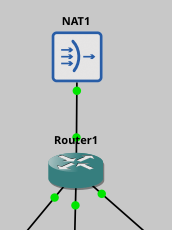

Pada tahap ini, dilakukan konfigurasi pada Router Lain agar dapat terhubung ke internet. Konfigurasi
dilakukan pada file konfigurasi jaringan dengan menambahkan pengaturan berikut:

Konfigurasi Router Lain:

```
auto eth0
iface eth0 inet dhcp
```


Setelah konfigurasi diterapkan, dilakukan pengujian konektivitas menggunakan perintah ping untuk
memastikan bahwa Router Lain telah berhasil terhubung ke internet. Hasil pengujian menunjukkan bahwa
koneksi berhasil, yang ditandai dengan adanya balasan dari host tujuan.

Testing dengan `ping`: 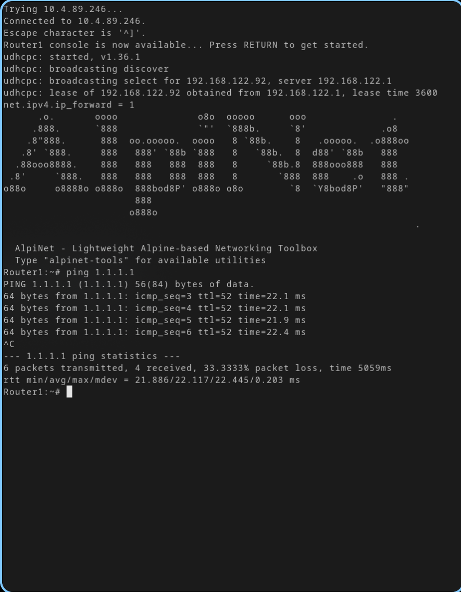

## 3. Menghubungkan Client satu sama lain

Konfigurasi Alice:

```
auto eth0
iface eth0 inet static
address 10.69.1.2
netmask 255.255.255.0
gateway 10.69.1.1
```

Konfigurasi Mika:

```
auto eth0
iface eth0 inet static
address 10.69.1.3
netmask 255.255.255.0
gateway 10.69.1.1
```

Konfigurasi Chisa:

```
auto eth0
iface eth0 inet static
address 10.69.2.2
netmask 255.255.255.0
gateway 10.69.2.1
```

Konfigurasi Knight:

```
auto eth0
iface eth0 inet static
address 10.69.3.2
netmask 255.255.255.0
gateway 10.69.2.1
```

Konfigurasi Eiri:

```
auto eth0
iface eth0 inet static
address 10.69.3.3
netmask 255.255.255.0
gateway 10.69.3.1
```

Testing `ping` dari `Knight` ke `Eiri`: 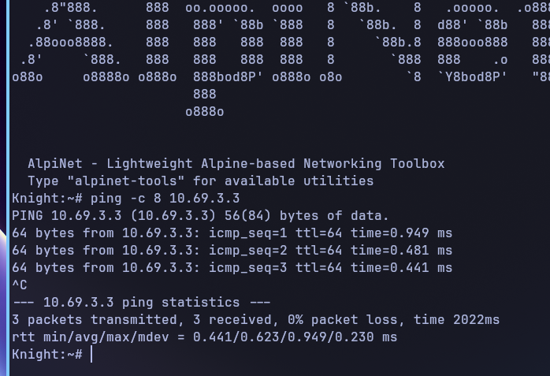

## 4. Menghubungkan Clients ke Internet

### Konfigurasi Source NAT

Karena alamat Clients (yang terletak pada konfigurasi Clients) merupakan _Private IP_, router harus
menyamarkan IP Address sumber paket menjadi milik eth0, saat paket keluar menuju internet.

Konfigurasi dilakukan dengan menambahkan konfigurasi Router Lain:

```
auto eth0
iface eth0 inet dhcp
	up sysctl -w net.ipv4.ip_forward=1
	up iptables -t nat -A POSTROUTING -o eth0 -j MASQUERADE
	up iptables -A FORWARD -i eth1 -o eth0 -j ACCEPT
	up iptables -A FORWARD -i eth2 -o eth0 -j ACCEPT
	up iptables -A FORWARD -i eth0 -m state --state ESTABLISHED,RELATED -j ACCEPT

auto eth1
iface eth1 inet static
		address 10.69.1.1
		netmask 255.255.255.0

auto eth2
iface eth2 inet static
		address 10.69.2.1
		netmask 255.255.255.0

auto eth3
iface eth3 inet static
		address 10.69.3.1
		netmask 255.255.255.0
```

### Konfigurasi DNS Resolver

Konfigurasi DNS Resolver dilakukan dengan run command melalui console Clients:

```sh
echo "nameserver 8.8.8.8" > /etc/resolv.conf
```

Untuk memastikan konfigurasi DNS Resolver selalu benar, tambahkan konfigurasi baru ke dalam
konfigurasi setiap Clients:

```
auto eth0
iface eth0 inet static
    address 10.69.1.2
    netmask 255.255.255.0
    gateway 10.69.1.1
    dns-nameservers 8.8.8.8 1.1.1.1 #---> konfigurasi DNS Resolver
```

Atau bisa juga seperti ini:

```
auto eth0
iface eth0 inet static
    address 10.69.1.2
    netmask 255.255.255.0
    gateway 10.69.1.1
	up echo "nameserver 8.8.8.8" >> /etc/resolv.conf #---> konfigurasi DNS Resolver
	up echo "nameserver 1.1.1.1" >> /etc/resolv.conf #---> konfigurasi DNS Resolver
```

`ping` ke google.com: 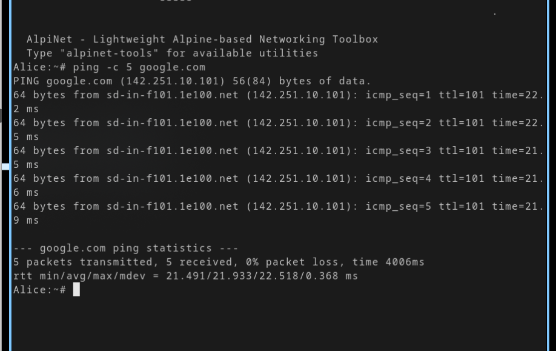

## 5. Script verifikasi (Lain)

Untuk mengecek apakah setelah di restart masih sama konfigurasinya dan masih terhubung maka buat
script [cek_status.sh](cek_status.sh):

disimpan di root yang berisi dibawah ini, berfungsi untuk menampilkan ringkasan interface dan status
tabel NAT

```sh
#!/bin/bash

ip -br a
iptables -t nat -L -v -n
```

buat script menjadi executable:

```sh
chmod +x cek_status.sh
```

jalankan script:

```sh
./cek_status.sh
```

Output: 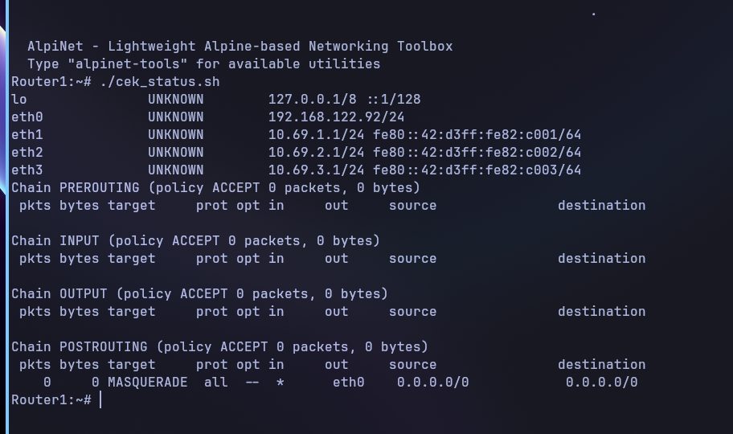

## 6. Deteksi traffic

Kita disuruh untuk mengirimkan traffic dan kemudian dianalisis menggunakan Wireshark

Script yang disediakan
[Generator traffic](https://drive.google.com/drive/folders/1ZjFvWIjvAQAjE9pPthm7V_bGyaSt93lY?usp=sharing):

script berisi ping dan dns lookup, hanya sebagai upaya cek apakah ping berhasil dan membuka info
beberapa domain melalui command `dig`

```sh
chmod +x traffic_protocol7.sh && ./traffic_protocol7.sh
```

Output: 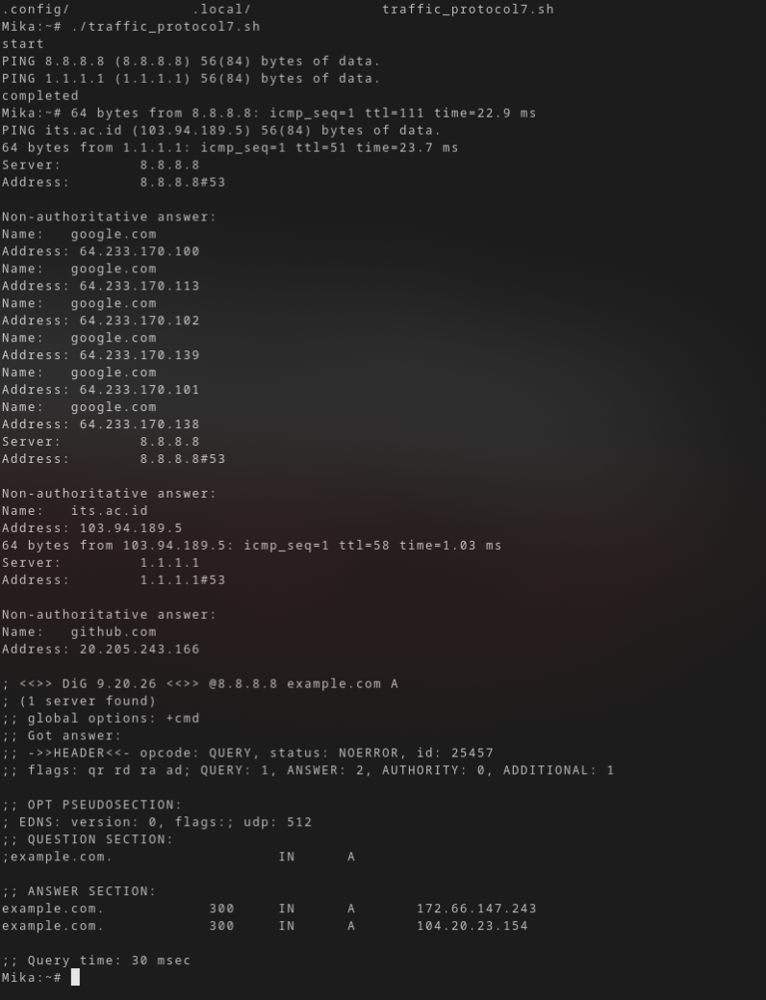

Packet sniffing menggunakan wireshark, dengan filter `dns or icmp` :
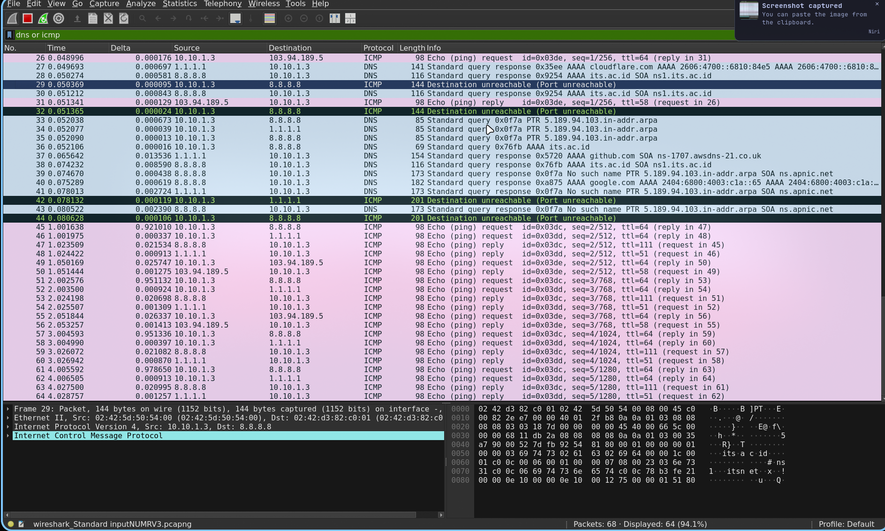 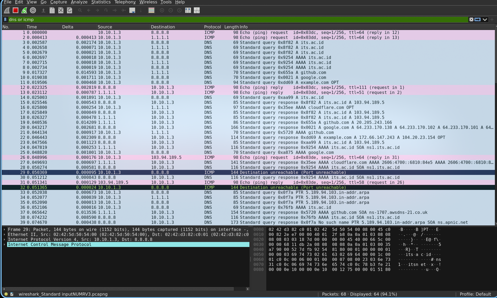

## 7. Setup FTP Server

### Di node Chisa

```sh
apk add vsftpd
```

Install vsftpd sebagai FTP Server di node Chisa

```
mkdir -p /var/wired/data
chmod 755 /var/wired/data
```

Buat folder sharing untuk diakses ke FTP usernya dan beri akses 755 sebagai akses penuh

```sh
adduser -D -h /var/wired/data alice
echo "alice:password123" | chpasswd

adduser -D -h /var/wired/data mika
echo "mika:password123" | chpasswd

adduser -D -h /var/wired/data eiri
echo "eiri:password123" | chpasswd

```

Setelah itu buat user di node Chisa sebagai user yang bisa akses ke FTP nantinya, set password sederhana.

Masuk ke Editor, `nano`:
```sh
nano /etc/vsftpd/vsftpd.conf
```

isi `/etc/vsftpd/vsftpd.conf`:
```conf
#config vsftpd.conf
anonymous_enable=NO
local_enable=YES
write_enable=YES
local_umask=022
chroot_local_user=YES
allow_writeable_chroot=YES
userlist_enable=YES
userlist_file=/etc/vsftpd.user_list
userlist_deny=NO
seccomp_sandbox=NO
```

Setup konfigurasi untuk hak akses di FTP dan registrasi ke usernya:
```
mkdir -p /etc/vsftpd/user_conf

echo "write_enable=YES" > /etc/vsftpd/user_conf/alice
echo "write_enable=NO" > /etc/vsftpd/user_conf/mika

echo "user_config_dir=/etc/vsftpd/user_conf" >> /etc/vsftpd/vsftpd.conf

chown alice:alice /var/wired/data
chmod 755 /var/wired/data

touch /etc/vsftpd.user_list
printf "alice\nmika\n" > /etc/vsftpd.user_list


cat /etc/vsftpd.user_list

```

Jalankan FTP Servernya di background:
```sh
vsftpd /etc/vsftpd/vsftpd.conf &
```

### Beralih node Alice
```sh
apk add lftp
```

Install lftp untuk FTP Client

```sh
lftp -u alice,password123 10.69.2.2
```

Masuk ke FTP Server Chisa melalui lftp dengan IP Chisa

```sh
lftp alice@10.69.2.2:/> ls
```

Cek koneksi dengan FTP melalui command ls

Keluar dari console FTP , sekarang buat file `signal_alice.txt`

```sh
touch signal_alice.txt

nano signal_alice.txt
```

Login lagi ke console FTP, jalankan perintah menambahkan file ke FTP Server dengan `put`

```sh
put signal_alice.txt
```

Jika berhasil maka akan keluar pesan seperti `205 bytes transferred`

## 8. Upload file ke FTP Server Chisa dari Knight
### Di Node Chisa
Pastikan sedang berada pada `root` Node Chisa dan `FTP Server` sudah berjalan di *background* pada Node Chisa. Kemudian, buat file `knight_report.txt` sesuai dengan ketentuan soal:
```sh
nano knight_report.txt
```

### Di node Knight
Masuk ke FTP Chisa menggunakan akun dan kredensial Alice
```sh
lftp -u alice,password123 10.69.2.2
```

Start Capture dari Chisa untuk membuka Wireshark, kemudian baru masuk ke FTP lagi dan jalankan perintah:
```sh
put knight_report.txt
```

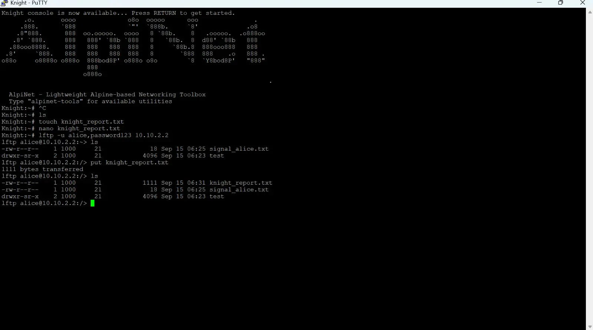

Lihat dan analisa lalu lintas packet melalui Wireshark
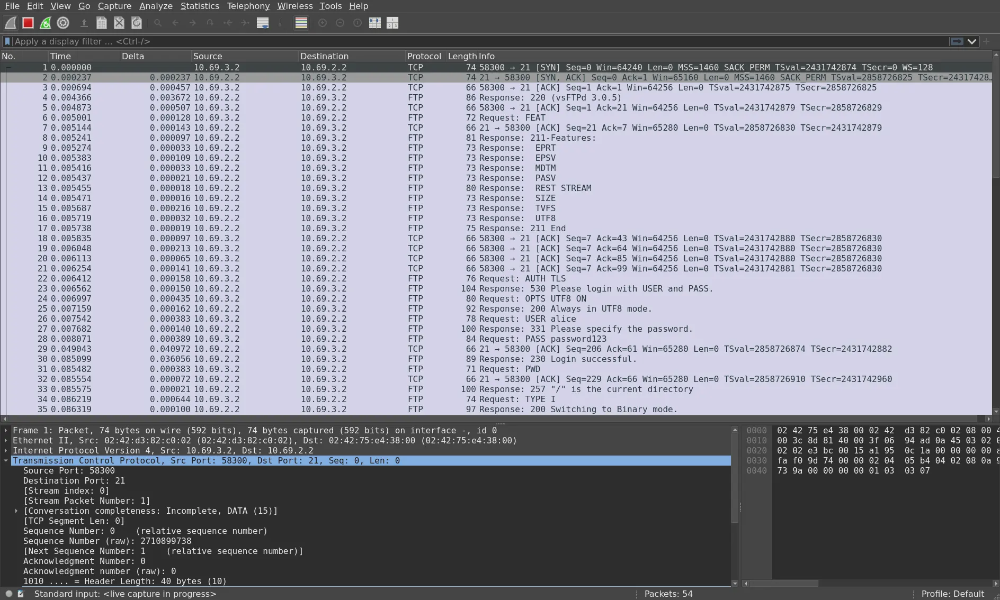

## 9. Uji coba akses FTP Server

Pertama buat file atau tambahkan file di node Chisa

```sh
touch protocol7_manifesto.txt
nano protocol7_manifesto.txt
```

atau dari drive nya

kemudian dicoba melakukan read file dari account Mika dengan

```sh
cat protocol7_manifesto.txt
```

dan berhasil karena akses Mika yang read-only. Kemudian dicoba write file atau put menggunakan akun
Mika juga

```sh
put test.txt
```

dan menunjukkan `access failed 550: permission denided`

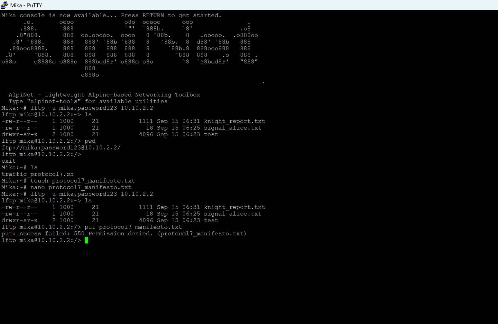

## 10. Uji ketahanan koneksi

Pada soal ini FTP Server Chisa akan diuji menggunakan packet dari node Knight dengan payload khusus
128 bytes dan interval 0.3 detik sebanyak 77 paket

```sh
ping -c 77 -s 128 -i 0.3 10.69.2.2
```

setelah semua packet dikirimkan akan muncul RTT (min/avg/max) nya dan dianalisa ECHO request dan
ECHO reply nya menggunakan capture Wireshark

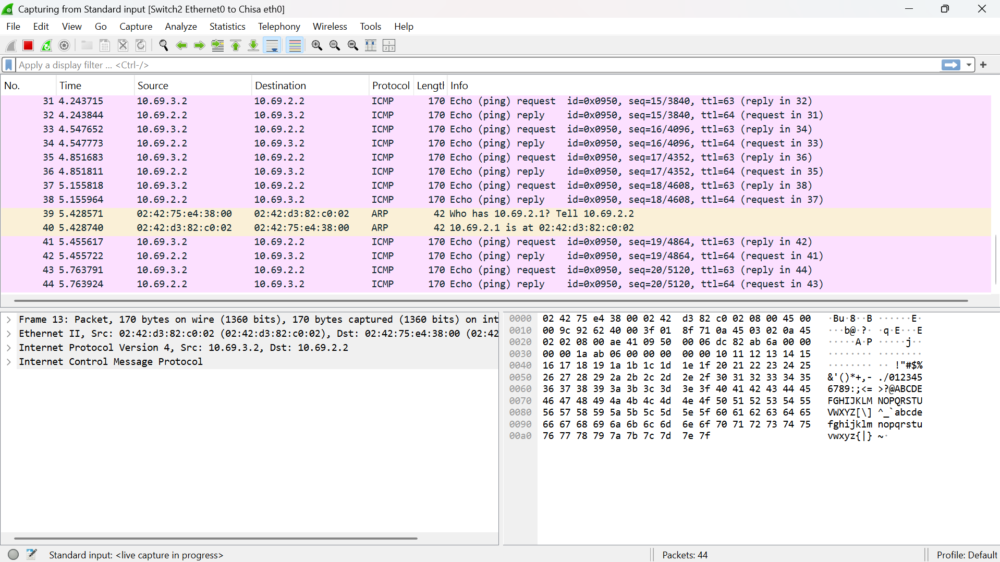 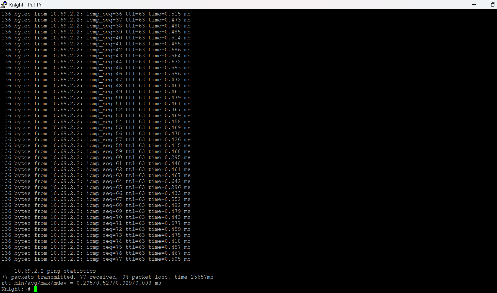

## 11. Bukti kelemahan protokol Telnet

Konfigurasi Telnet pada Alpine Linux agar router/server dapat diakses melalui Telnet dari GNS3.
Install telnet melalui busybox extras

```sh
apk add busybox-extras
```

Tambahkan konfigurasi Telnet ke `/etc/inetd.conf`

```sh
echo "telnet stream tcp nowait root /usr/sbin/telnetd telnetd -i -l /bin/login" >> /etc/inetd.conf

cat /etc/inetd.conf
```

kemudian jalankan inetd atau telnet melalui background

```sh
inetd -f &
```

kemudian tambahkan user baru untuk telnet-nya

```sh
adduser phantom_user

cat /etc/passwd | grep phantom_user
```

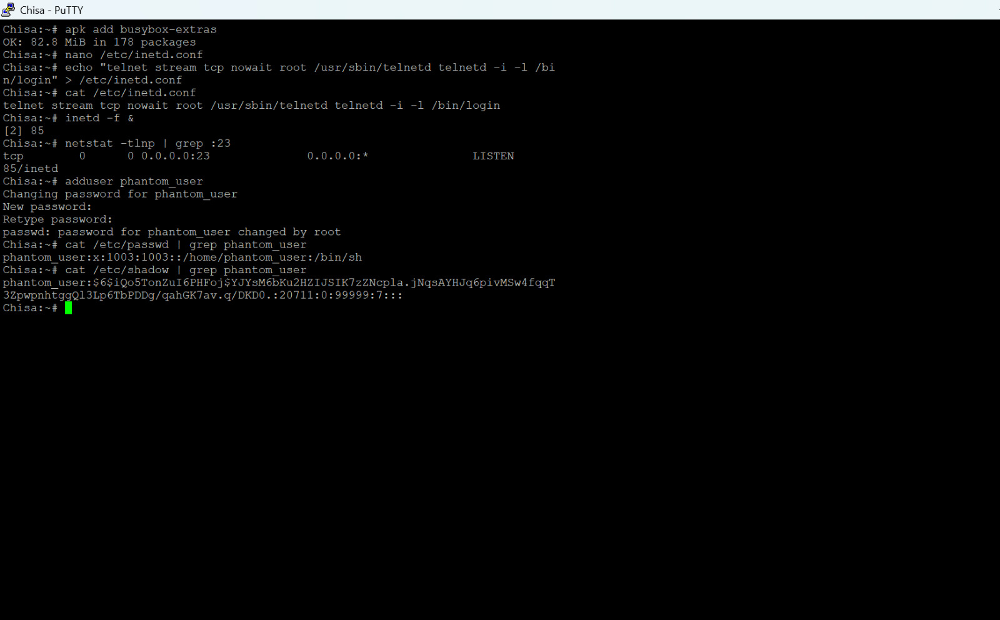 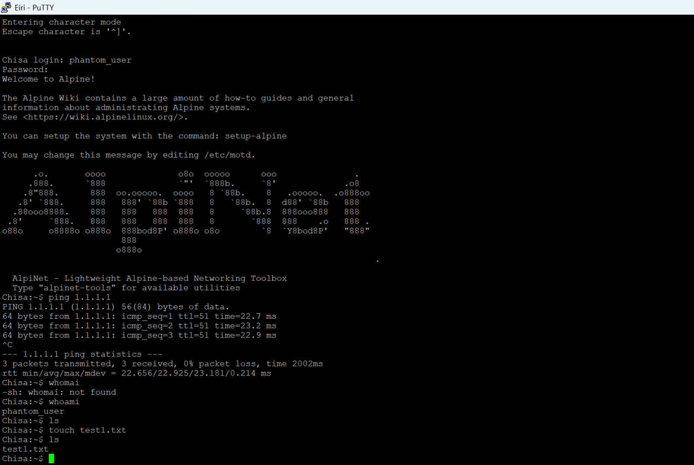

Berpindah ke Eiri, masuk ke jaringan telnet Chisa dengan command

```sh
telnet 10.69.2.2
```

Kemudian check koneksi menggunakan

```
whoami

pwd

touch test.txt

ls
```

Capture packet menggunakan Wireshark dan ditemukan packet dengan protocol Telnet

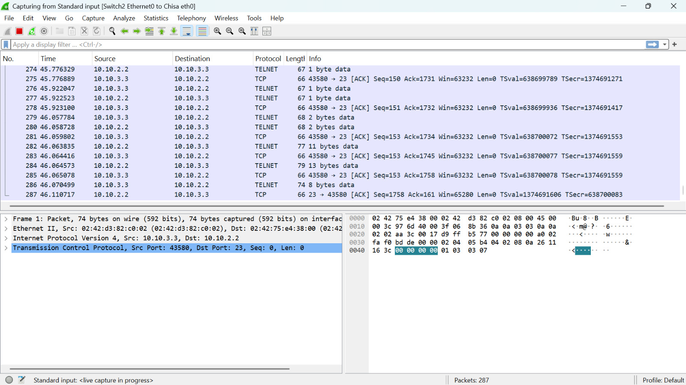

Ditemukan bahwa instruksi melalui telnet dapat dibaca atau disadap tanpa melakukan enkripsi dan juga
data nya terkirim karakter per karakter melalui fitur Wireshark Follow TCP Stream

## 12. Pemindaian Port

Alice akan melakukan scanning port pada host Knight melalui command netcat. Untuk itu pertama kita
jalankan beberapa service pada Knight misalnya SSH, HTTP dan 7777 kosong sebagai uji.

```sh
#install dan setup openssh

apk add openssh

ssh-keygen -A

/usr/sbin/sshd

#setup http server
mkdir -p /var/wwww

httpd -p 80 -h /var/www


#cek port apakh terbuka
netstat -tlnp
```

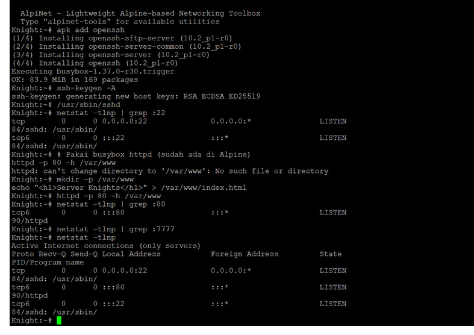

setelah terbuka semua, sekarang pindah ke Alice. Jalankan

```sh
nc -zv 10.69.3.2 22

nc -zv 10.69.3.2 80

nc -zv 10.69.3.2 7777
```

untuk mengecek apakah port terbuka jika dari host Alice

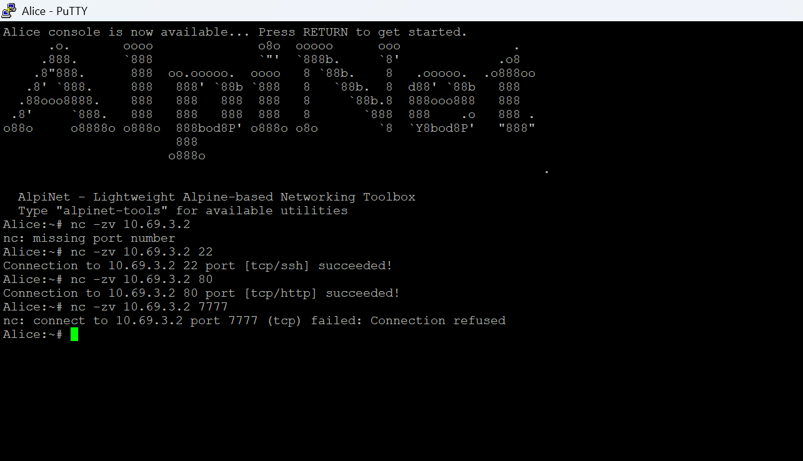

kemudian capture dan lihat bagaimana hasilnya

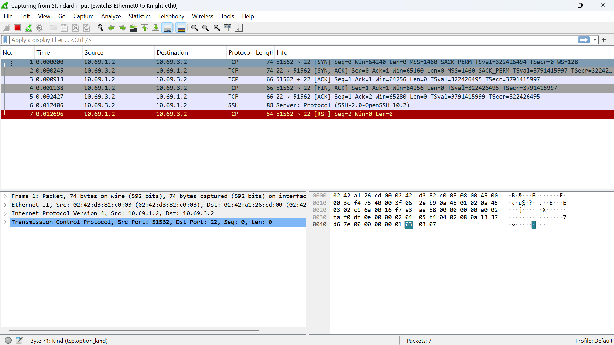 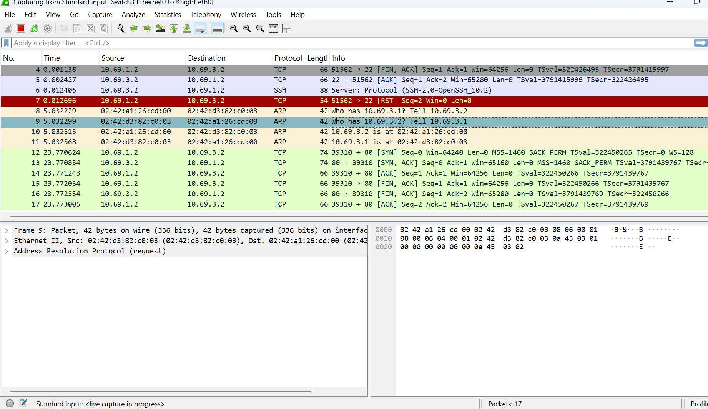

## 13. Koneksi OpenSSH

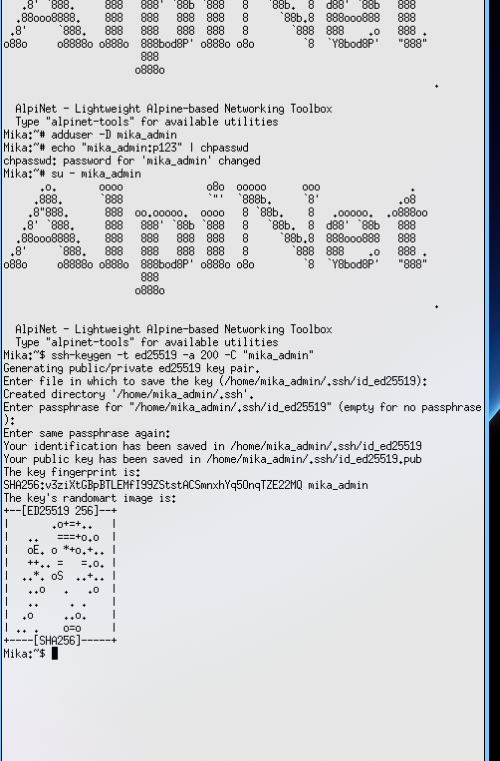

Proses pembuatan pasangan kunci SSH pada node Mika untuk user mika_admin menggunakan: 
```sh
ssh-keygen -t ed25519
```

Kunci disimpan di /home/mika_admin/.ssh/ dengan nama id_ed25519 (private key) dan `id_ed25519.pub` (public key). Karena menggunakan opsi -N "", kunci dibuat tanpa passphrase sehingga bisa dipakai untuk login otomatis tanpa prompt password.

```sh
adduser -D mika_admin


su - mika_admin
```

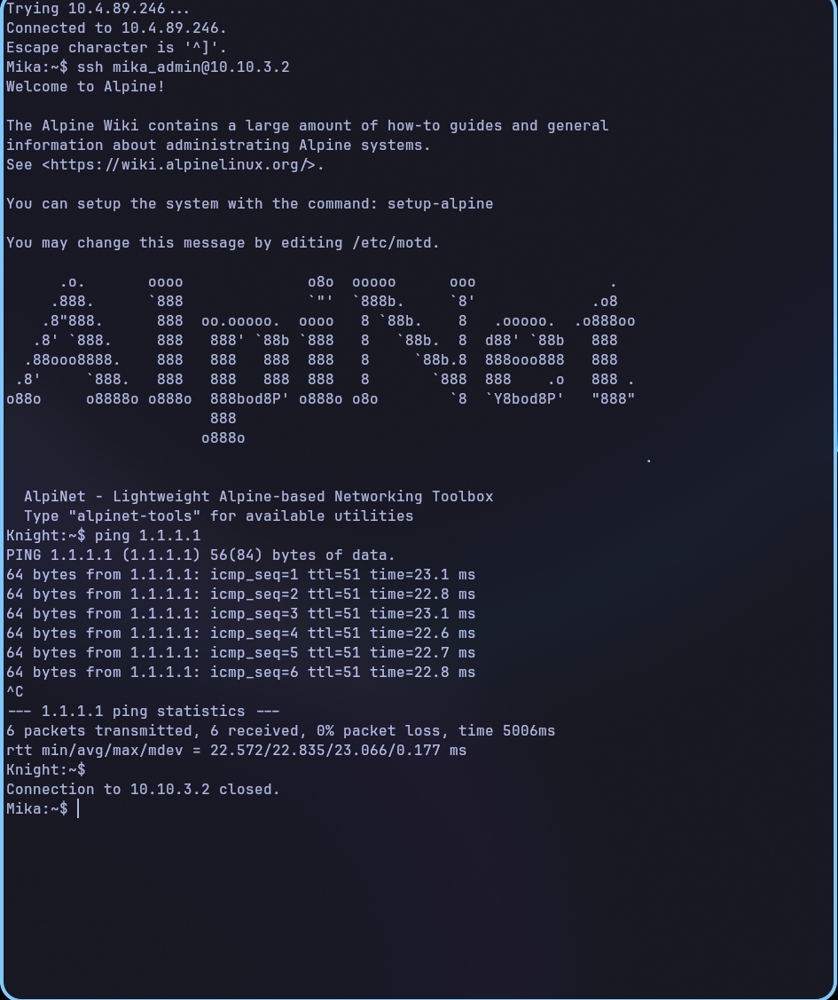

koneksi SSH dari node Mika ke node Knights (ssh mika_admin@10.69.3.2) yang berhasil masuk tanpa
diminta password. Setelah masuk ke prompt `Knights:~$`, dilakukan uji konektivitas dengan ping 1.1.1.1
yang menghasilkan 0% packet loss.

### Revisi

Sesuai ketentuan soal yaitu konfigurasi `PasswordAuthentication no` sehingga tidak perlu set
password di awal

```sh
# Di Node Mika
ssh-keygen -t ed25519 -C "mika_admin" -f ~/.ssh/id_ed25519 -N ""
ssh-copy-id -i ~/.ssh/id_ed25519.pub mika_admin@10.10.3.2

# Di Node Knights
sed -i 's/#PasswordAuthentication yes/PasswordAuthentication no/' /etc/ssh/sshd_config
rc-service sshd restart

# Uji koneksi tanpa password
ssh mika_admin@10.10.3.2
ping 1.1.1.1
```

## 14. Brute force form login web Alice

```txt
http.request.method == "POST"
```

- IP Penyerang : 172.26.7.50
- IP Target : 172.26.7.100
- Port Penyerang : 49161 (Salah satu)
- Port Target: 8080

```txt
http contains "lain_admin"
```

username: lain_admin password: wired_pr0tocol_7

```txt
http.response
```

Webserver : Apache/2.4.62

```txt
ip.src == 172.26.7.50 && ip.dst == 172.26.7.100 && tcp.dstport == 8080
```

```txt
tcp.flags.syn == 1 &&
ip.src == 172.26.7.50 &&
ip.dst == 172.26.7.100 &&
tcp.dstport == 8080
```

```txt
ip.src == 172.26.7.50 &&
ip.dst == 172.26.7.100 &&
tcp.dstport == 8080 &&
http.request.method == "POST"
```

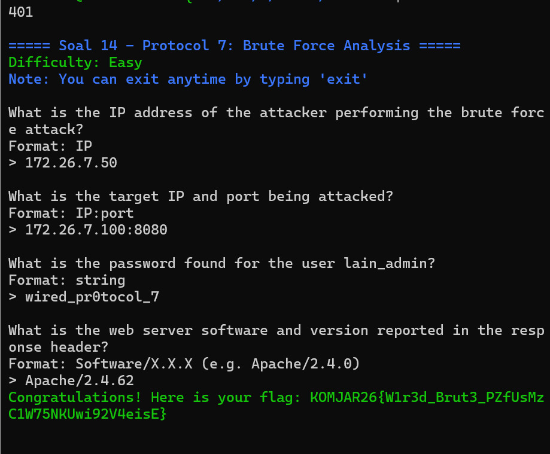

## 15. Keyboard USB berbahaya

Filter wireshark: `usb.bDescriptorType == 1

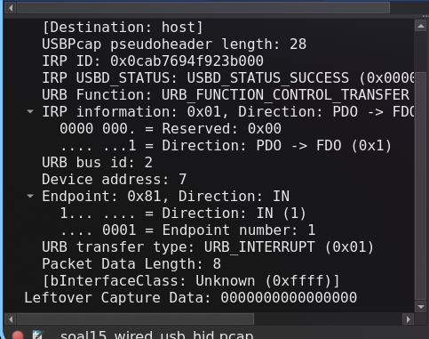

- Vendor ID: Logitech, Inc. (0x046d)
- Product ID: Keyboard K120 (0xc31c)
- Alamat nomor device USB: 7
- Pesan rahasia yg dicuri: `Wired_Protocol_7_is_alive_2026`

```sh
tshark -r soal15_wired_usb_hid.pcap -Y "usb.capdata" -T fields -e usb.capdata > keystrokes.txt
```

```txt
cat keystrokes.txt
02001a0000000000
0000000000000000
00000c0000000000
0000000000000000
0000150000000000
0000000000000000
0000080000000000
0000000000000000
0000070000000000
0000000000000000
02002d0000000000
0000000000000000
0200130000000000
0000000000000000
0000150000000000
0000000000000000
0000120000000000
0000000000000000
0000170000000000
0000000000000000
0000120000000000
0000000000000000
0000060000000000
0000000000000000
0000120000000000
0000000000000000
00000f0000000000
0000000000000000
02002d0000000000
0000000000000000
0000240000000000
0000000000000000
02002d0000000000
0000000000000000
00000c0000000000
0000000000000000
0000160000000000
0000000000000000
02002d0000000000
0000000000000000
0000040000000000
0000000000000000
00000f0000000000
0000000000000000
00000c0000000000
0000000000000000
0000190000000000
0000000000000000
0000080000000000
0000000000000000
02002d0000000000
0000000000000000
00001f0000000000
0000000000000000
0000270000000000
0000000000000000
00001f0000000000
0000000000000000
0000230000000000
0000000000000000
```

Kemudian `USB HID` ini kita decode, sehingga didapat pesan sebagai berikut:
`Wired_Protocol_7_is_alive_2026`.

Keempat data tadi selanjutnya diverifikasi menggunakan `nc`:
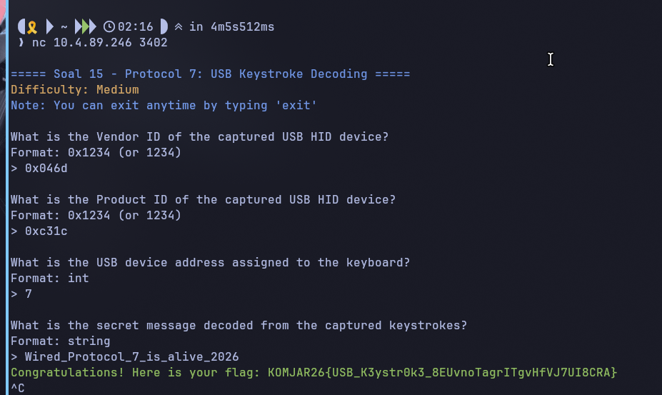

## 16. Analisis lalu lintas FTP

```txt
ftp
```

- IP Penyerang : 10.7.3.20
- IP Target : 10.7.3.60

```txt
ftp.response.code == 220
```

- Banner software FTP : FTP Server (vsftpd 3.0.5)

```txt
ftp.request.command == "USER" || ftp.request.command == "PASS"
```

USER knights_agent PASS N4v1_s3cur3_2026

```
ftp
```

- File size knight : 524288 bytes

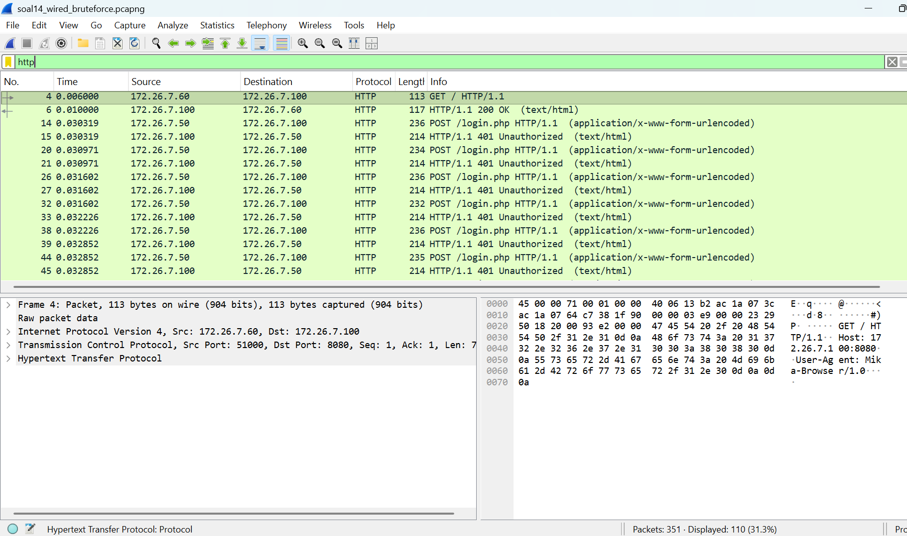 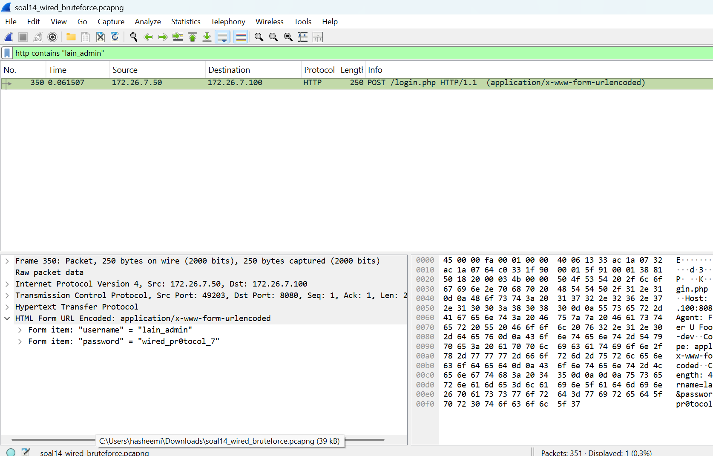

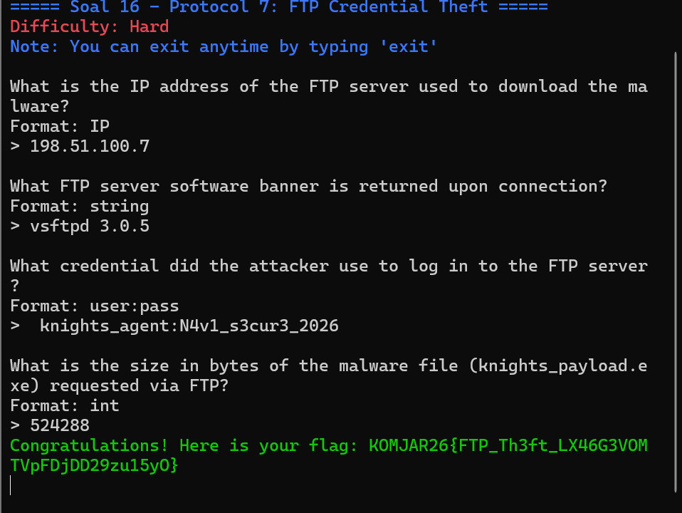

## 17. Download malware di node Alice

Filter: `http.request.method == "GET"`

- Nama Domain tempat malware diunduh: `wired-update.net`: 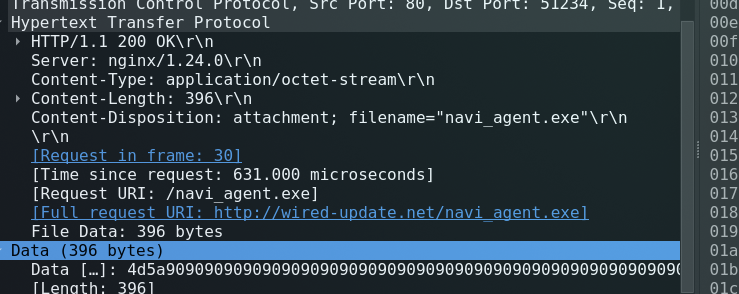

- IP Address attacker: `203.0.113.42`: 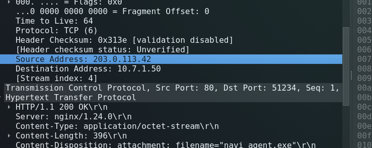

- Nama file malware: navi_agent.exe 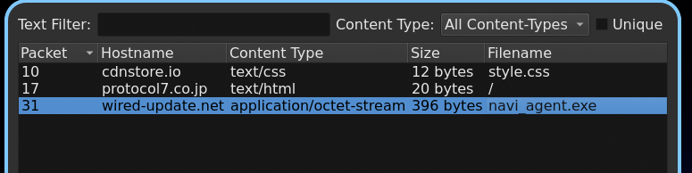

- Kode status HTTP: `200` 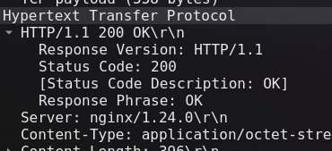 Verifikasi dengan `nc`:
  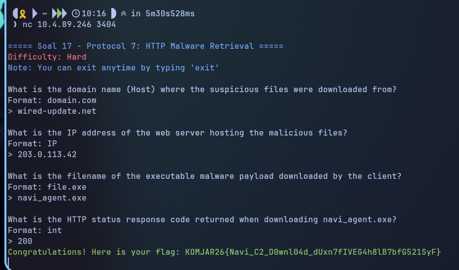

## 18. Analisis serangan protokol SMB

```txt
smb || smb2
```

- IP Penyerang : 10.7.3.100
- IP Target : 10.7.3.50
- Protokol jaringan : SMB

```txt
smb2.filename contains ".exe"
```

- Folder tujuan penyimpanan : System32
- Nama file malware : wired_trojan_payload.exe

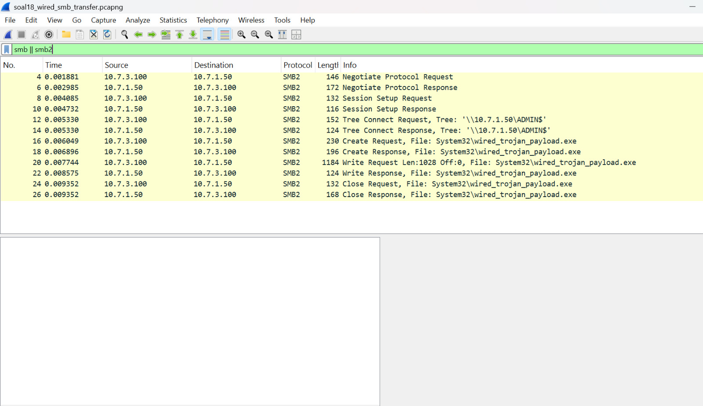

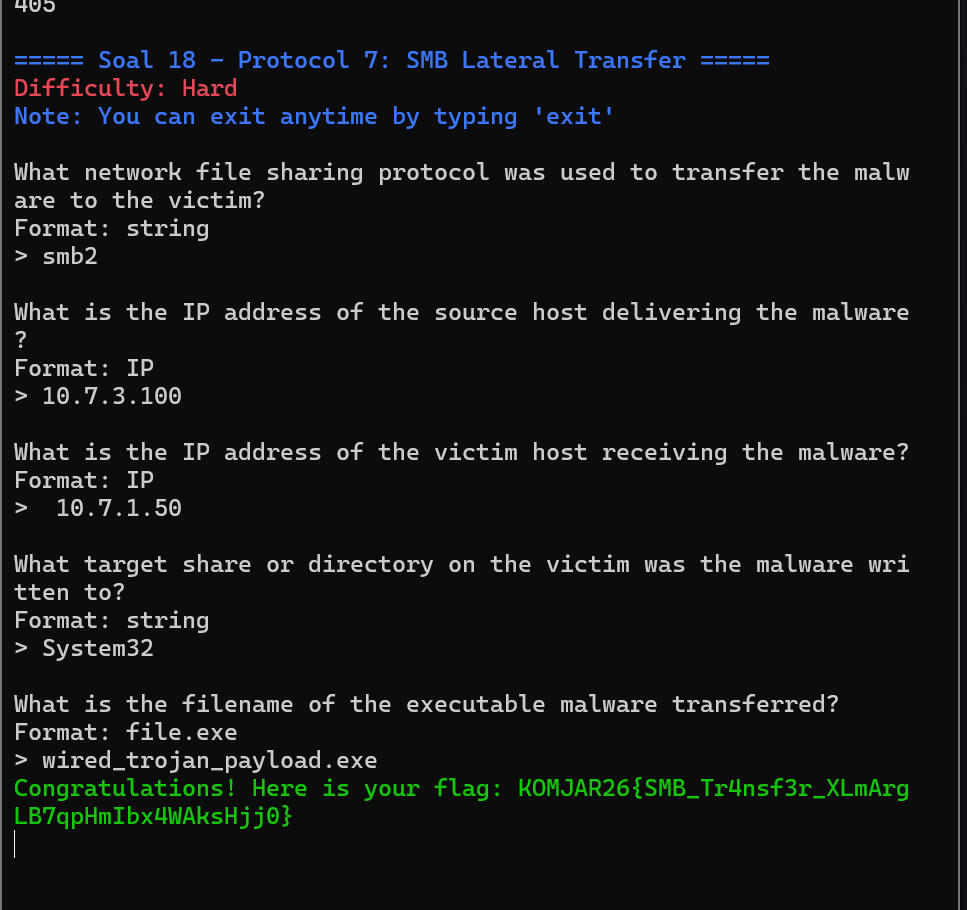

## 19. Email Blackmail

- Alamat Email Korban: victim@protocol7.co.jp 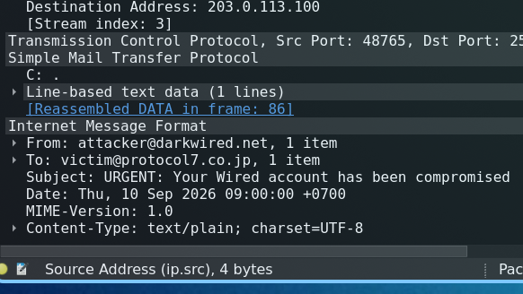

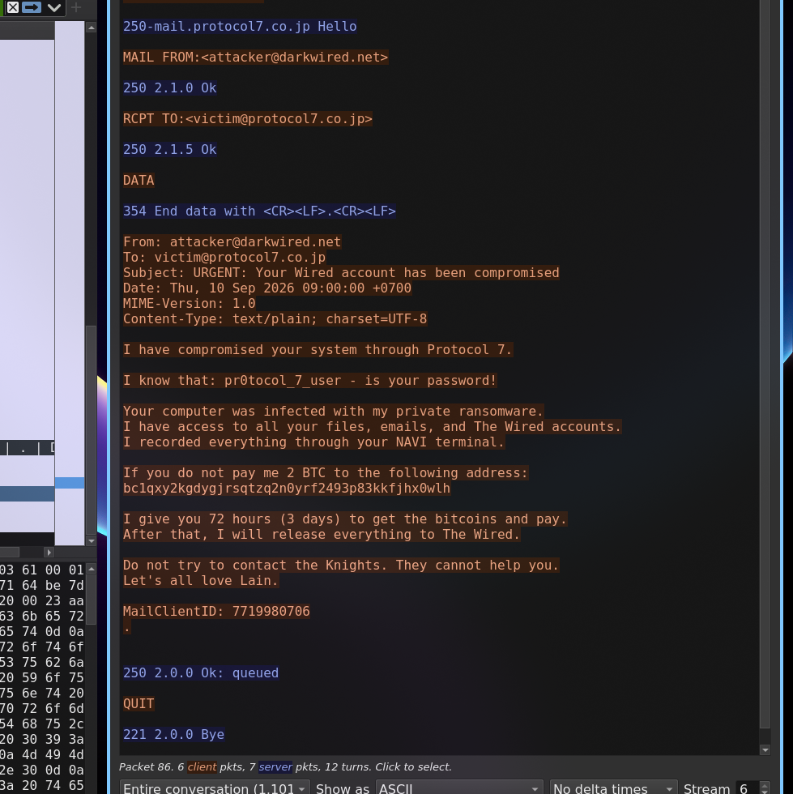

- Password bocor: `pr0tocol_7_user`
- Jenis Malware: `ransomware`
- Batas waktu: `72 Hours (3 days)`
- MailClientID: `7719980706` 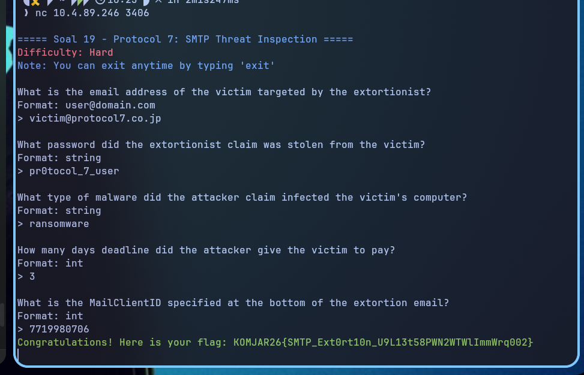

## 20. Nice try Eiri

```txt
tls.handshake.type == 2
```

- Versi protokol TLS : TLSV1.2

```txt
tls.handshake.extensions_server_name
```

- Domain name (SNI) : example.com

- IP Penyerang : 93.184.216.34
- IP Target : 10.9.0.2

```txt
http.user_agent
```

- User-Agent : curl/7.62.0

```txt
http.request
```

- Request method : HEAD
- Request URi : /

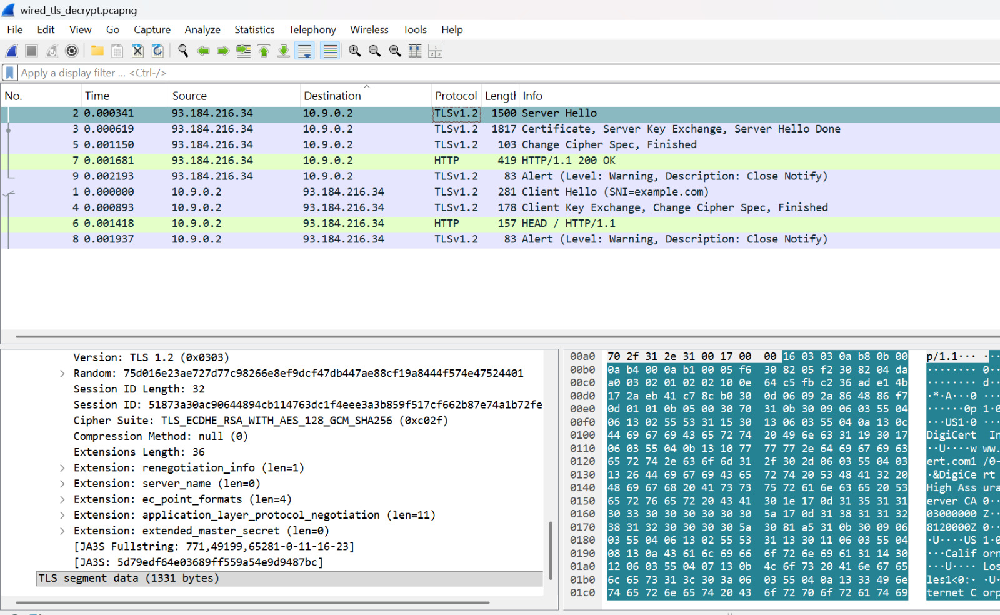

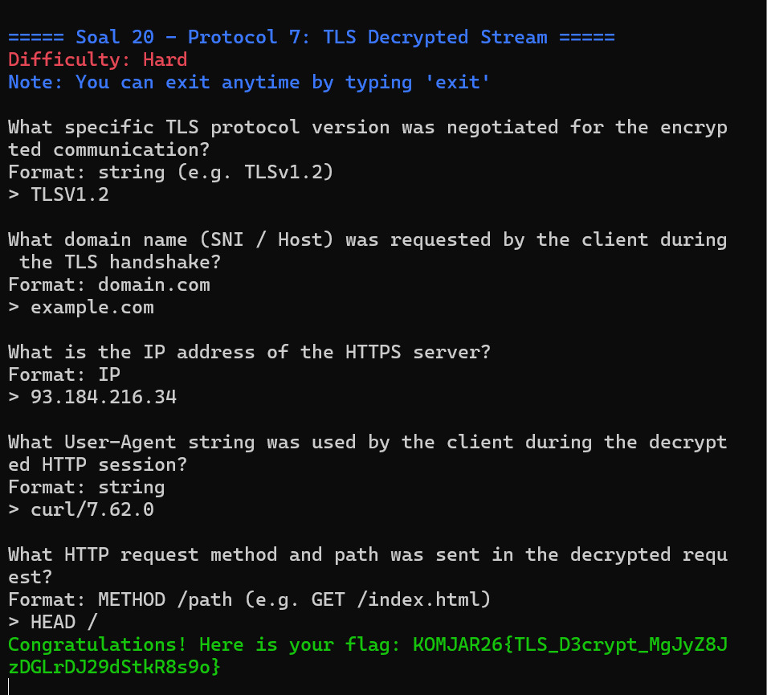
