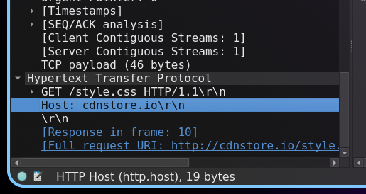
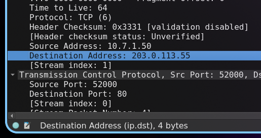
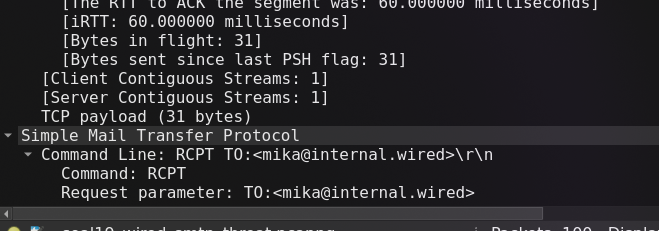

# Jarkom-Modul-1-2026-K-11

## 1. Mempersiapkan pembangunan The Wired

## 2. Konfigurasi Router Lain agar bisa terhubung ke internet


Konfigurasi Router Lain:
```
auto eth0
iface eth0 inet dhcp
```


Testing dengan `ping`:


## 3. Menghubungkan Client satu sama lain

Konfigurasi Alice:
```
auto eth0
iface eth0 inet static
address 10.69.1.2
netmask 255.255.255.0
gateway 10.69.1.1
```

Konfigurasi Mika:
```
auto eth0
iface eth0 inet static
address 10.69.1.3
netmask 255.255.255.0
gateway 10.69.1.1
```

Konfigurasi Chisa:
```
auto eth0
iface eth0 inet static
address 10.69.2.2
netmask 255.255.255.0
gateway 10.69.2.1
```

Konfigurasi Knight:
```
auto eth0
iface eth0 inet static
address 10.69.3.2
netmask 255.255.255.0
gateway 10.69.2.1
```

Konfigurasi Eiri:
```
auto eth0
iface eth0 inet static
address 10.69.3.3
netmask 255.255.255.0
gateway 10.69.3.1
```

Testing `ping` dari `Knight` ke `Eiri`:


## 4. Menghubungkan Clients ke Internet

### Konfigurasi Source NAT

Karena alamat Clients (yang terletak pada konfigurasi Clients) merupakan _Private IP_, router harus
menyamarkan IP Address sumber paket menjadi milik eth0, saat paket keluar menuju internet.

Konfigurasi dilakukan dengan menambahkan konfigurasi Router Lain:

```
auto eth0
iface eth0 inet dhcp
	up sysctl -w net.ipv4.ip_forward=1
	up iptables -t nat -A POSTROUTING -o eth0 -j MASQUERADE
	up iptables -A FORWARD -i eth1 -o eth0 -j ACCEPT
	up iptables -A FORWARD -i eth2 -o eth0 -j ACCEPT
	up iptables -A FORWARD -i eth0 -m state --state ESTABLISHED,RELATED -j ACCEPT

auto eth1
iface eth1 inet static
		address 10.69.1.1
		netmask 255.255.255.0

auto eth2
iface eth2 inet static
		address 10.69.2.1
		netmask 255.255.255.0

auto eth3
iface eth3 inet static
		address 10.69.3.1
		netmask 255.255.255.0
```

### Konfigurasi DNS Resolver

Konfigurasi DNS Resolver dilakukan dengan run command melalui console Clients:

```sh
echo "nameserver 8.8.8.8" > /etc/resolv.conf
```

Untuk memastikan konfigurasi DNS Resolver selalu benar, tambahkan konfigurasi baru ke dalam
konfigurasi setiap Clients:

```
auto eth0
iface eth0 inet static
    address 10.69.1.2
    netmask 255.255.255.0
    gateway 10.69.1.1
    dns-nameservers 8.8.8.8 1.1.1.1 #---> konfigurasi DNS Resolver
```

Atau bisa juga seperti ini:

```
auto eth0
iface eth0 inet static
    address 10.69.1.2
    netmask 255.255.255.0
    gateway 10.69.1.1
	up echo "nameserver 8.8.8.8" >> /etc/resolv.conf #---> konfigurasi DNS Resolver
	up echo "nameserver 1.1.1.1" >> /etc/resolv.conf #---> konfigurasi DNS Resolver
```

`ping` ke google.com:


## 5. Script verifikasi (Lain)
[cek_status.sh](cek_status.sh):
```sh
#!/bin/bash

ip -br a
iptables -t nat -L -v -n
```

buat script menjadi executable:
```sh
chmod +x cek_status.sh
```

jalankan script:
```sh
./cek_status.sh
```
Output:


## 6. Deteksi traffic

Jalankan [Generator traffic](https://drive.google.com/drive/folders/1ZjFvWIjvAQAjE9pPthm7V_bGyaSt93lY?usp=sharing):
```sh
chmod +x traffic_protocol7.sh && ./traffic_protocol7.sh
```
Output:


Packet sniffing menggunakan wireshark, dengan filter `dns or icmp` :


## 7. Setup FTP Server

## 8. Upload file ke FTP Server Chisa

## 9. Uji coba akses FTP Server

## 10. Uji ketahanan koneksi

## 13.


## 14. Brute force form login web Alice

```txt
http.request.method == "POST"
```

- IP Penyerang : 172.26.7.50
- IP Target : 172.26.7.100
- Port Penyerang : 49161 (Salah satu)
- Port Target: 8080

```txt
http contains "lain_admin"
```

username: lain_admin password: wired_pr0tocol_7

```txt
http.response
```

Webserver : Apache/2.4.62

```txt
ip.src == 172.26.7.50 && ip.dst == 172.26.7.100 && tcp.dstport == 8080
```

```txt
tcp.flags.syn == 1 &&
ip.src == 172.26.7.50 &&
ip.dst == 172.26.7.100 &&
tcp.dstport == 8080
```

```txt
ip.src == 172.26.7.50 &&
ip.dst == 172.26.7.100 &&
tcp.dstport == 8080 &&
http.request.method == "POST"
```

## 15. Keyboard USB berbahaya

Filte wireshark: `usb.bDescriptorType == 1

- Vendor ID: Logitech, Inc. (0x046d)
- Product ID: Keyboard K120 (0xc31c)
- Alamat nomor device USB: 7
- Pesan rahasia yg dicuri:

```sh
tshark -r soal15_wired_usb_hid.pcap -Y "usb.capdata" -T fields -e usb.capdata > keystrokes.txt
```

```txt
cat keystrokes.txt
02001a0000000000
0000000000000000
00000c0000000000
0000000000000000
0000150000000000
0000000000000000
0000080000000000
0000000000000000
0000070000000000
0000000000000000
02002d0000000000
0000000000000000
0200130000000000
0000000000000000
0000150000000000
0000000000000000
0000120000000000
0000000000000000
0000170000000000
0000000000000000
0000120000000000
0000000000000000
0000060000000000
0000000000000000
0000120000000000
0000000000000000
00000f0000000000
0000000000000000
02002d0000000000
0000000000000000
0000240000000000
0000000000000000
02002d0000000000
0000000000000000
00000c0000000000
0000000000000000
0000160000000000
0000000000000000
02002d0000000000
0000000000000000
0000040000000000
0000000000000000
00000f0000000000
0000000000000000
00000c0000000000
0000000000000000
0000190000000000
0000000000000000
0000080000000000
0000000000000000
02002d0000000000
0000000000000000
00001f0000000000
0000000000000000
0000270000000000
0000000000000000
00001f0000000000
0000000000000000
0000230000000000
0000000000000000
```


## 16.

```txt
ftp
```

- IP Penyerang : 10.7.3.20
- IP Target : 10.7.3.60

```txt
ftp.response.code == 220
```

- Banner software FTP : FTP Server (vsftpd 3.0.5)

```txt
ftp.request.command == "USER" || ftp.request.command == "PASS"
```

USER knights_agent PASS N4v1_s3cur3_2026

```
ftp
```

- File size knight : 524288 bytes

## 17. Malware di node Alice

Filter: `http.request.method == "GET"`

- Nama Domain tempat malware diunduh: `cdnstore.io\r\n`


- IP Address attacker: `203.0.113.55`


- Nama file malware: navi_agent.exe


- Kode status HTTP: `200`


## 18.

```txt
smb || smb2
```

- IP Penyerang : 10.7.3.100
- IP Target : 10.7.3.50
- Protokol jaringan : SMB

```txt
smb2.filename contains ".exe"
```

- Folder tujuan penyimpanan : System32
- Nama file malware : wired_trojan_payload.exe

## 19. Email Blackmail
- Alamat Email Korban: mika@internal.wired



- Password bocor: `pr0tocol_7_user`
- Jenis Malware: `ransomware`
- Batas waktu: `72 Hours (3 days)`
- MailClientID: `7719980706`

## 20.

```txt
tls.handshake.type == 2
```

- Versi protokol TLS : TLSV1.2

```txt
tls.handshake.extensions_server_name
```

- Domain name (SNI) : example.com

- IP Penyerang : 93.184.216.34
- IP Target : 10.9.0.2

```txt
http.user_agent
```

- User-Agent : curl/7.62.0

```txt
http.request
```

- Request method : HEAD
- Request URi : /
